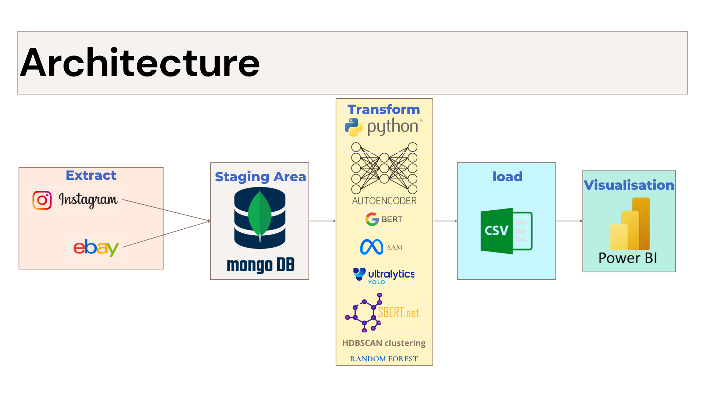

# Fashion Trends Analysis Project

This project is a comprehensive system for analyzing fashion trends by processing multimodal data (text, images, and numerical metrics) from Instagram and eBay. It leverages advanced machine learning techniques to scrape, process, and visualize data, providing insights into consumer preferences, emerging trends, and market dynamics. The pipeline includes data ingestion, image and text processing, sentiment analysis, clustering, and interactive dashboards for actionable insights.

---

## Technologies Used

### Programming & Libraries
[](https://www.python.org/)  
[](https://numpy.org/)  
[](https://pandas.pydata.org/)  
[](https://docs.python-requests.org/)  
[](https://opencv.org/)  
[](https://scikit-learn.org/)  
[](https://git-scm.com/)


### Data Storage
[](https://www.mongodb.com/)


### Web Scraping
[](https://www.crummy.com/software/BeautifulSoup/)  
[](https://scrapy.org/)  
[](https://www.selenium.dev/)


### Computer Vision & Deep Learning
[](https://pytorch.org/)  
[](https://www.tensorflow.org/)  
[](https://docs.ultralytics.com/)  
[](https://github.com/facebookresearch/segment-anything)


### NLP Models
[](https://huggingface.co/transformers/model_doc/bert.html)  
[](https://www.sbert.net/)  
[](https://huggingface.co/transformers/)  
[](https://github.com/UKPLab/sentence-transformers)


### Machine Learning Algorithms
[](https://scikit-learn.org/stable/modules/generated/sklearn.ensemble.RandomForestClassifier.html)  
[](https://hdbscan.readthedocs.io/en/latest/)


### Data Visualization
[](https://powerbi.microsoft.com/)

## 🏗️ Architecture



## 📁 Project Structure

The project is organized into three main components:

- **Instagram Data Pipeline (`code_Scrap_process_Instagram_data`)**:  
  Scrapes Instagram data, processes images and text, performs segmentation, sentiment analysis, and model training.

- **eBay Fashion Data Pipeline (`code_Scrap_process_Ebay_data`)**:  
  Collects and processes eBay fashion product data, including descriptions, prices, and feedback.

- **Dashboards**:  
  Interactive Power BI dashboards for visualizing trends, engagement metrics, and sentiment analysis for both Instagram and eBay data.

---

## Folder Structure

```
code_Scrap_process_Instagram_data/
├── code_Insta/
├── data/
├── devide.py
├── download_images.py
├── encode_image.py
├── HDBSCAN_clusters.py
├── images/
├── model_train/
├── models/
├── run.py
├── scrap_insta_data.py
├── segment-anything/
├── segment.py
├── sentiment_analysis.py
├── temp/
├── myenv/
├── Readme
├── requirements.txt
```

## System Architecture

The system is designed to process multimodal data through a pipeline of ingestion, storage, processing, and visualization.

---

## Prerequisites

- Python 3.11.8
- MongoDB for data storage
- Power BI for dashboard visualization
- Required Python libraries (listed in `requirements.txt`)

---

## Setup Instructions

### 1. Download Project Files
Download the full project from this [Google Drive link](https://drive.google.com/drive/folders/17iqyuFY5RwhNZDRW5BseI3-Zm0J75Kz5) due to the large size of some files (e.g., datasets, trained models).

### 2. Navigate to the Segment Anything Model

```bash
cd code_Scrap_process_Instagram_data/segment-anything
```

### 3. Install Segment Anything

```bash
pip install -e .
```

### 4. Install Dependencies

Ensure Python is installed, then run:

```bash
pip install -r requirements.txt
```

### 5. Set Up MongoDB

- Install MongoDB locally or use a cloud instance.
- Configure the connection in scripts like `scrap_insta_data.py` or eBay scripts.

### 6. Run the Instagram Data Pipeline

```bash
cd code_Scrap_process_Instagram_data/
python run.py
```

This script orchestrates:

- Scraping: `scrap_insta_data.py`
- Image downloading: `download_images.py`
- Encoding: `encode_image.py`
- Segmentation: `segment.py`
- Clustering: `HDBSCAN_clusters.py`
- Sentiment Analysis: `sentiment_analysis.py`

### 7. Run the eBay Data Pipeline

Refer to readme file in code_Scrap_process_Ebay_data

---

## Launch Dashboards

- Open Power BI dashboard files in the `Dashboards/` folder using Power BI Desktop.

---

## Key Components

### Instagram Pipeline

- **Scraping**: Collects images, captions, and comments (`scrap_insta_data.py`)
- **Image Processing**: Downloads (`download_images.py`), encodes (`encode_image.py`), and segments (`segment.py`)
- **Clustering**: Groups similar posts using HDBSCAN (`HDBSCAN_clusters.py`)
- **Sentiment Analysis**: Uses BERT-based models (`sentiment_analysis.py`)

### Dashboards

- **Instagram**: Engagement metrics, sentiment distribution, cluster visualization
- **eBay**: Product volumes, pricing trends, color preferences, and feedback

---

## Perspectives (Future Work)

To enhance the system further, we plan to:

- **Develop a Web-Based Dashboard using Django**  
  Replace Power BI with a fully interactive web dashboard built using Django for real-time monitoring and visualization.

- **Enable Automated and Batch Updates**  
  Implement periodic scraping and processing tasks using Celery and Django Background Tasks to ensure data freshness without manual execution.

- **Use a Data Warehouse instead of CSV files**  
  Integrate a proper data warehousing solution such as Google BigQuery, Amazon Redshift, or PostgreSQL for efficient large-scale querying, replacing local CSV-based analytics.

---

## Acknowledgments

This project was inspired by the [Future Fashion Trends Forecasting](https://github.com/surabhi135/Future-Fashion-Trend-Forecasting) repository.

Special thanks to **Professor Imad Sassi** for his invaluable guidance and support throughout the project.
